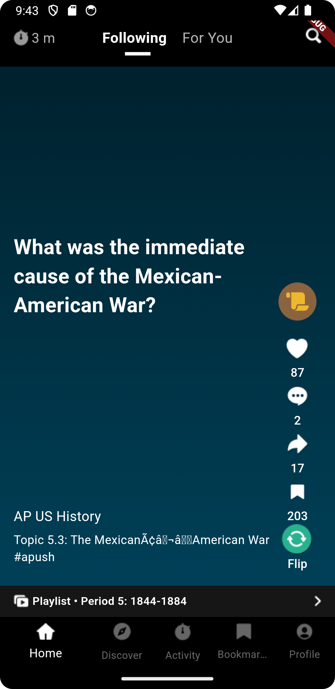
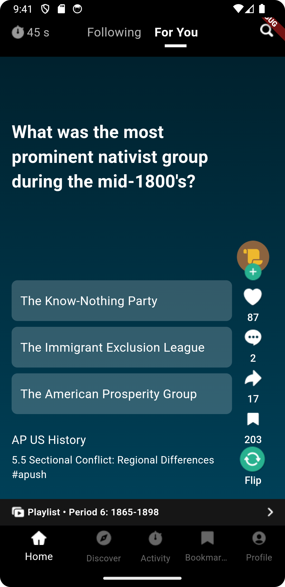
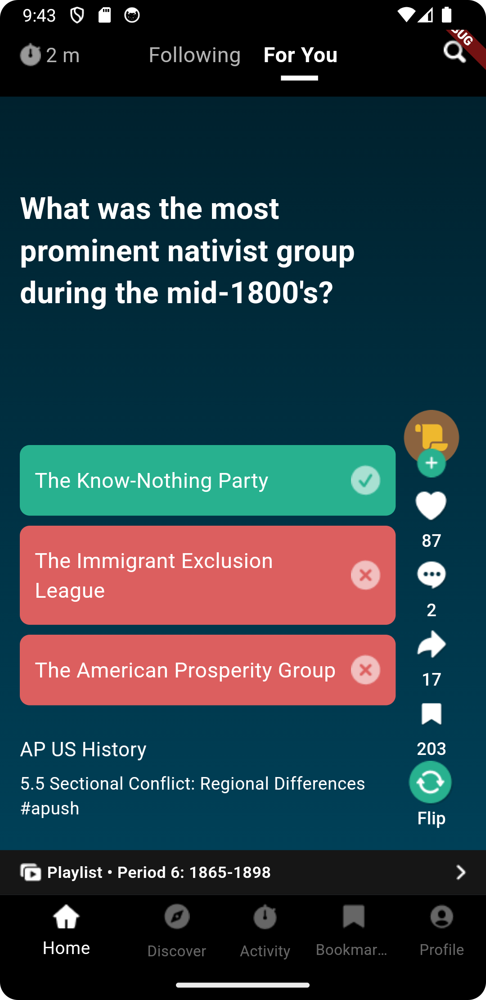

# Tik Tok Clone

An application that implements infinite scroll like TikTok.

It shows different kinds of cards instead of videos based on the tab selection.

## Following

This tab displays a flash card with a Question which displays the answer after pressing it.

## For You

This tab displays a Multiple-question card which can answered by selecting one of the answers.

## Other Functionalities

The other buttons including Like, Comment, Share, and Save are static for now.
