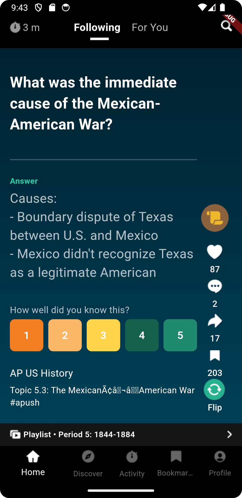

# Tik Tok Clone

An application that implements infinite scroll like TikTok.

It shows different kinds of cards instead of videos according to the tab selection.

## Following

This tab displays a flash card with a Question that displays the answer after pressing it.

## For You

This tab displays a Multiple-question card that can answered by selecting one of the answers.

## Other Functionalities

The other buttons including the Like, Comment, Share, and, Save are static for now.
